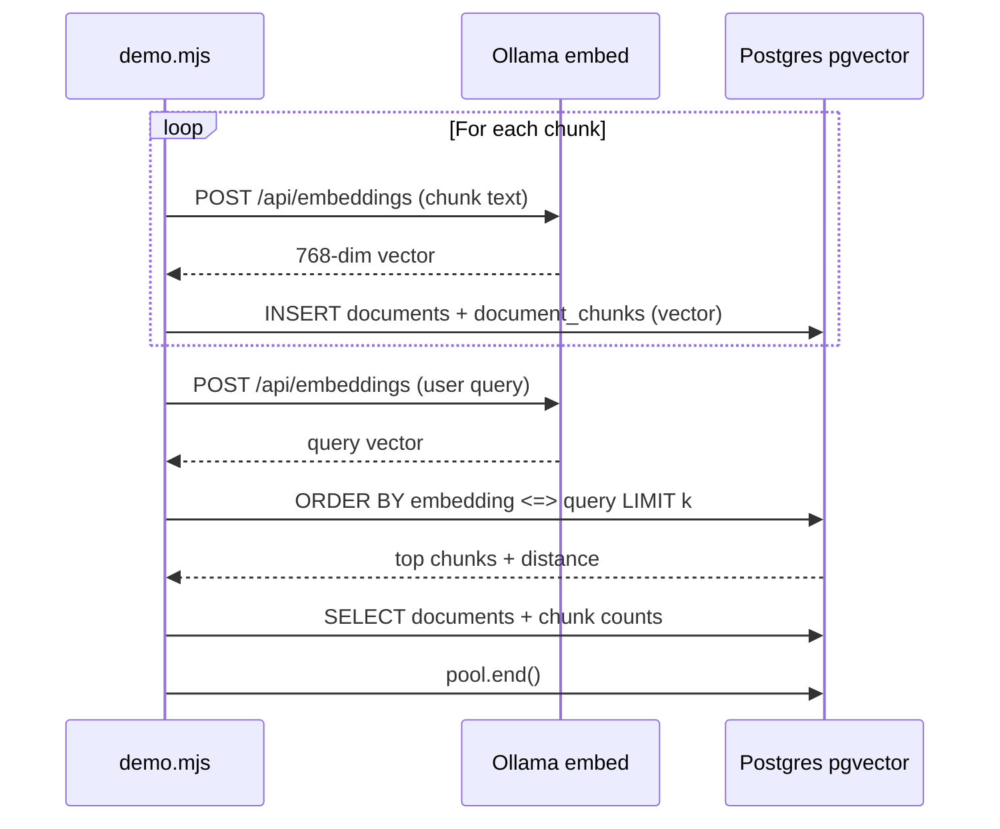
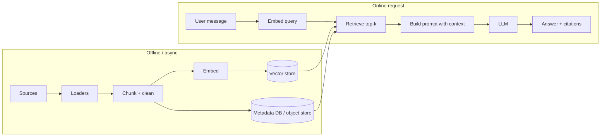

Here’s the **demo app system flow** as your code actually runs (`demo.mjs` + helpers).

---

### Actors

| Piece | Role |
|--------|------|
| **Node** (`demo.mjs`) | Orchestrates: embed → insert → search → list |
| **Ollama** (`embed.js`) | Turns a string → 768-dim vector (`nomic-embed-text`) |
| **PostgreSQL + pgvector** | Stores rows + runs nearest-neighbor query |

---

### Phase 1 — Startup

1. `dotenv/config` loads `.env` → **`DATABASE_URL`** (and Ollama vars).
2. **`db.js`** builds a **`pg` connection pool** to Postgres.
3. **`main()`** runs.

---

### Phase 2 — Ingest (loop twice: “JS on the server”, “Python ML”)

For **each** sample document:

4. For **each chunk string** in that doc:
   - **`embed(content)`** → HTTP `POST` to Ollama `/api/embeddings` → returns **`embedding`** (length 768).
   - Build `{ index, content, embedding }` in memory.

5. **`insertDocumentWithChunks(...)`** (`crud.js`):
   - **BEGIN** transaction.
   - **INSERT** one row into **`documents`** (title, source_uri, metadata) → **UUID** `document_id`.
   - For each chunk: **INSERT** into **`document_chunks`** with `embedding` cast to **`vector(768)`** (`toVectorParam` sends JSON string `"[...]"`).
   - **COMMIT** (or ROLLBACK on error).
   - Returns `document_id`; demo logs it.

**Data shape after this:** `documents` has 2 rows; `document_chunks` has 4 rows (2 chunks × 2 docs), each with a vector and text.

---

### Phase 3 — Query (semantic search)

6. **`query`** = `'which language is good for machine learning?'`
7. **`embed(query)`** → same Ollama path → **query vector** `qEmb` (768 dims).
8. **`searchSimilar(qEmb, 4)`**:
   - `pool.query` runs SQL: for every row in **`document_chunks`**, compute **cosine distance** **`embedding <=> $1::vector`**, **ORDER BY** that distance (ascending = nearest first), **LIMIT 4**.
   - Returns rows: `chunk_id`, `document_id`, `chunk_index`, `content`, **`distance`**.

9. Demo **logs** each hit (distance + doc id + chunk index + snippet).

**Conceptually:** “Which stored chunk vectors are closest to the query vector in embedding space?”

---

### Phase 4 — List (plain SQL, no vectors)

10. **`listDocuments(10)`** → `JOIN` + `GROUP BY` to show each `documents` row with **chunk_count**.

11. Demo prints that table.

---

### Phase 5 — Shutdown

12. **`pool.end()`** closes DB connections. (Your delete block is **commented out**, so nothing is deleted in the current file.)

---

### End-to-end diagram (same process)

---

### What’s *not* in this demo (but real RAG would add)

- No LLM call after the search: the “next step” would be **send `hits[].content` + user question** to a chat model.
- No reranking, dedup, or filters (tenant, ACL, `document_id` filter).

---

### One-liner

**Embed every chunk → store vectors in Postgres → embed the question → pgvector finds nearest chunk vectors → you read `content` from those rows (here: only printed; in an app: feed into a prompt).**

---
# 2nd Talk
Here’s **high-level RAG as system design**, using three product shapes. Same core pattern everywhere: **ingest → index → retrieve → generate (optional tools)**.

---

### Shared core (all three)

- **Ingestion**: policies/docs/transcripts → **chunks** → **embeddings** → **vector DB**; keep **metadata** (source id, permissions, timestamps).
- **Query**: user text → **same embedder** → **similarity search** → **top-k chunks** → **prompt** → **LLM** → answer (ideally **with sources**).

Failure modes you design for: **stale KB**, **wrong retrieval**, **PII**, **hallucination** → mitigations: filters, rerankers, “I don’t know,” human escalation, eval.

---

### 1) Booking RAG (hotels, flights, packages)

**Goal:** Natural-language Q&A grounded in **inventory, policies, and user-specific booking state**.

| Layer | Typical content |
|--------|------------------|
| **Knowledge** | Fare rules, cancellation policy, destination FAQs, partner T&Cs |
| **Transactional** | “My trip”, “PNR”, dates — usually **not** only in vectors; needs **APIs/DB** |

**Flow (high level)**

1. **User:** “Can I change my return to Sunday if I booked Flex?”
2. **Router (optional):** Detect intent — *policy question* vs *change booking*.
3. **Retrieve:** Embed question → vector search over **policy chunks** (+ maybe **FAQ** by city/airline).
4. **Augment prompt:** Top chunks + **structured facts** if you have them (fare class from PNR lookup).
5. **LLM:** Answer in brand voice; **cite** policy snippets.
6. **If action required:** Don’t let the LLM “call APIs” blindly without guardrails — use **tools** (search flights, modify booking) with **confirmed user + idempotency**.

**Design nuance:** RAG handles **language + policy text**; **booking state** comes from **OLTP / reservation service**, not from embeddings alone.

---

### 2) Support RAG (helpdesk / internal KB)

**Goal:** Resolve tickets using **past tickets, runbooks, product docs**, with **escalation** when confidence is low.

| Layer | Typical content |
|--------|------------------|
| **KB** | How-tos, troubleshooting, known errors |
| **Tickets** | Historical resolutions (PII-scrubbed chunks) |
| **Product** | Version-specific behavior (index **version** in metadata) |

**Flow**

1. **User/case:** Error message + environment + account tier.
2. **Pre-filter metadata:** `product=X`, `version=Y`, `region=Z` → **narrow retrieval** (critical for support).
3. **Retrieve:** Vector search + sometimes **BM25 hybrid** (exact error codes match literally).
4. **Rerank (common):** Cross-encoder or small model → best 3–5 chunks.
5. **LLM:** Step-by-step fix; **link** to official doc; **disclaimer** for destructive steps.
6. **If still ambiguous:** **Create ticket** / **hand to human** with retrieved context attached.

**Design nuance:** **Metadata filters** and **hybrid search** matter more than in generic Q&A; **audit trail** (what was retrieved) is important.

---

### 3) Educational RAG (tutoring / course / syllabus Q&A)

**Goal:** Answers **grounded in curriculum** (textbook, lectures, assignments), optionally **Socratic** (hints, not full solutions).

| Layer | Typical content |
|--------|------------------|
| **Corpus** | PDFs, slides, lecture transcripts, glossary |
| **Pedagogy** | Learning objectives per chunk; difficulty |
| **Safety** | Age band; no exam leaks if that’s a rule |

**Flow**

1. **Student:** “Why does backprop use the chain rule here?”
2. **Scope:** Course id / module id → **filter** retrieval to **that course only**.
3. **Retrieve:** Top chunks from **relevant chapter** (metadata: `unit`, `page`).
4. **LLM:** Explain using **only** retrieved material; **cite** section/page; optional **hint ladder** (hint 1 → hint 2).
5. **Anti-cheat mode (optional):** For graded work, **refuse full solutions** or only retrieve **definitions**, not assignment answer keys.

**Design nuance:** **Strong scope filters** (`course_id`, `role=student`) and **pedagogical policy** in the system prompt matter as much as retrieval quality.

---

### Cross-cutting comparison (one table)

| Concern | Booking | Support | Education |
|--------|---------|---------|-----------|
| **Truth source** | Policies + live inventory | KB + tickets + logs | Curriculum corpus |
| **Must-have filters** | Product/locale, sometimes user id | Product/version/env | Course/module/role |
| **Actions** | APIs/tools for changes | Ticketing, remote actions | Usually read-only or hints |
| **Risk** | Wrong policy = $ / legal | Wrong fix = outage | Cheating / wrong teaching |

---

### Optional “full product” boxes (same diagram, more boxes)

- **Ingest:** OCR, web crawl, CMS sync, **PII redaction** before embed.
- **Orchestration:** Intent router, **query rewrite** (“expand for retrieval”).
- **Memory:** Short chat history summarized; **don’t** embed secrets.
- **Observability:** Log query, retrieved ids, latency, thumbs up/down.
- **Eval:** Golden questions per domain; regression when corpus updates.

---

**Bottom line:** All three are the **same RAG skeleton**; they differ in **what you index**, **what metadata you filter on**, and **what happens after the LLM** (APIs, tickets, pedagogy rules).  

Sources: common RAG architecture descriptions (e.g. [LlamaIndex](https://docs.llamaindex.ai/), [LangChain RAG](https://python.langchain.com/docs/tutorials/rag/)); your stack is just one concrete instance (Ollama embed + pgvector + LLM).